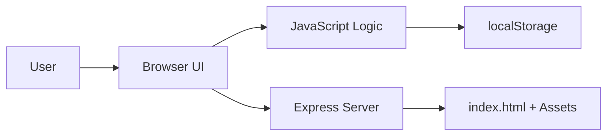

# Architecture Specification

## 1. Purpose

This document describes the current architecture of the Vanilla Web Starter project and defines how the existing pieces fit together.

## 2. Architectural Style

The application follows a simple client-server architecture:

- A static client layer renders the UI in the browser.
- A lightweight Node.js/Express server serves the assets locally.
- Browser storage is used for persistence instead of a database.

## 3. High-Level Components

### Client Layer

The browser loads the HTML, CSS, and JavaScript assets.

Responsibilities:
- Render the landing page
- Handle theme toggling
- Manage the idea form and list rendering
- Persist ideas in localStorage

### Server Layer

Express serves the app from the project root.

Responsibilities:
- Deliver static files
- Route all requests to index.html
- Provide a simple local development experience

## 4. Runtime Flow

## 5. Component Interaction

### Theme toggle

- The button in the header triggers a JavaScript handler.
- The handler toggles a CSS class on the body element.
- The button label updates to reflect the current theme state.

### Idea submission

- The form submit handler prevents the default browser behavior.
- The input value is trimmed and validated.
- The new idea is stored in the in-memory array and persisted to localStorage.
- The DOM is re-rendered with the updated list.

## 6. Data Flow

| Flow | Source | Destination | Purpose |
| --- | --- | --- | --- |
| Page load | Browser | localStorage | Load existing ideas |
| Submit idea | User input | localStorage | Persist new ideas |
| Render view | JavaScript state | DOM | Update visible list |
| Serve app | Browser request | Express server | Deliver page assets |

## 7. Storage Model

The application does not use a database. Persistence is browser-based and limited to the current device.

### Storage characteristics

- Simple key-value storage
- No server-side sync
- No multi-user support
- Data is tied to the browser profile

## 8. Deployment Model

The current deployment model is straightforward:

- Run locally using Node.js and Express
- Serve files directly from the project directory
- Suitable for local development and small demonstrations

## 9. Non-Functional Considerations

- Simplicity: The architecture is intentionally easy to read and understand.
- Portability: The app runs in any modern browser with Node.js available.
- Maintainability: Small file boundaries keep the code easy to extend.
- Accessibility: Interactive elements should remain keyboard-friendly and clearly labeled.

## 10. Evolution Path

If the app grows, the architecture can evolve in stages:

1. Add a backend API for persistent storage.
2. Introduce a routing layer for multiple views.
3. Split UI logic into modules or components.
4. Add automated tests and deployment automation.
